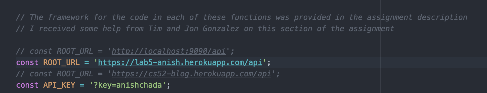
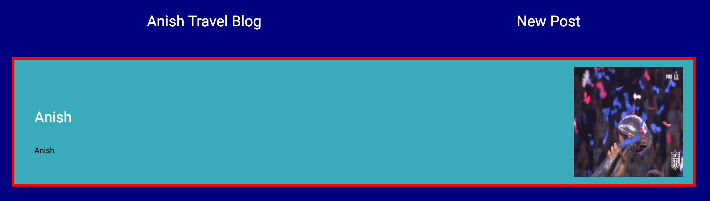

Anish Chadalavada  
Computer Science 52  
Lab Assignment 5 - Redux Blog Back End + Auth  
May 10, 2017  

In this final component we implemented authentication on the front end and back end of our Redux blog. We extended the model, controller, schema, and routes to incorporate users, rather than just handle posts. We continued to utilize Mongoose and MongoDB I had to disable consistent-returns in EsLint in order to not return next every time and mess up the asynchronous JS by automatically returning next. Another tough part was adding the username at the end, as going through the assignment to incorporate this without missing it anywhere took me a little longer than expected. I thought this assignment was a pretty cool one, as we got to tie together the front end and backend with authentication and users.

In this lab assignment we configured our own Mongo API server in order to connect to our Redux Blog front end. This assignment was greatly aided by the presence of short assignment 7, which helped me gain some familiarity with Mongoose and MongoDB, as well as the data flow and framework associated with the backend. We used Express routing and the post schema in order to build out our API. We first made sure that the routes were properly configured in order to ensure that the structure was correctly established (we just returned simple messages). We then implemented the post controller functions to call based on the route. We used Mongoose methods here. For me, the most difficult part of this assignment was the Update function. I had been setting the fields correctly, but they only rendered on a page refresh. This error turned out to be due to my use of {} brackets when I called res.json({result}) to return the information to the client. The curly brackets were unnecessary in this case. Apart from this and a few other slight bugs, I found this lab to be a relatively straightforward one. Thanks to all the TAs, and Tim, for helping me to debug.  

I thought it was very interesting to see how the front end and back end came together in a complete way by implementing the CRUD api. Before, the server side was abstracted out, but now, it is very cool to see how the front end and back end interact together.

Below is the one part I changed in my Lab 4 assignment (the ROOT_URL to point first to my own local host and then to the Heroku app instance of the server we implemented)  

  

An example of my functioning blog using the backend we implemented:  

  

Citations:  
http://mongoosejs.com/docs/api.html   
http://stackoverflow.com/questions/32811510/mongoose-findoneandupdate-doesnt-return-updated-document  
Discussed the methods of this assignment with Dami Apoeso and Justin Gualtieri.

http://stackoverflow.com/questions/14588032/mongoose-password-hashing
http://stackoverflow.com/questions/16882938/how-to-check-if-that-data-already-exist-in-the-database-during-update-mongoose  
http://stackoverflow.com/questions/25232423/mongo-mongoose-check-if-an-item-exists    
http://mongoosejs.com/docs/populate.html  

# starter express app template

* node with babel
* expressjs
* airbnb eslint rules

Procfile set up to run on [heroku](https://devcenter.heroku.com/articles/getting-started-with-nodejs#deploy-the-app)
